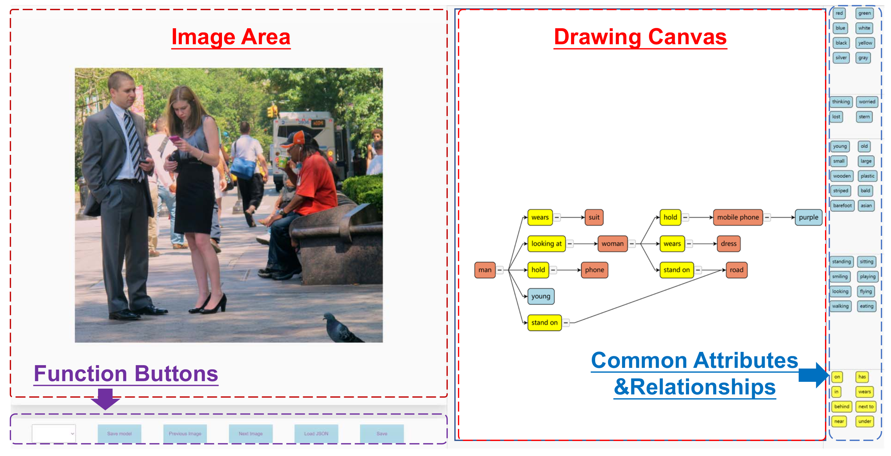
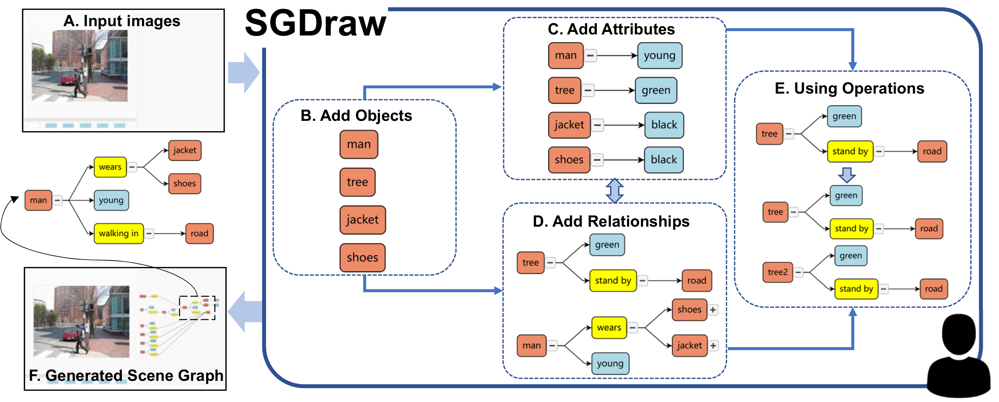
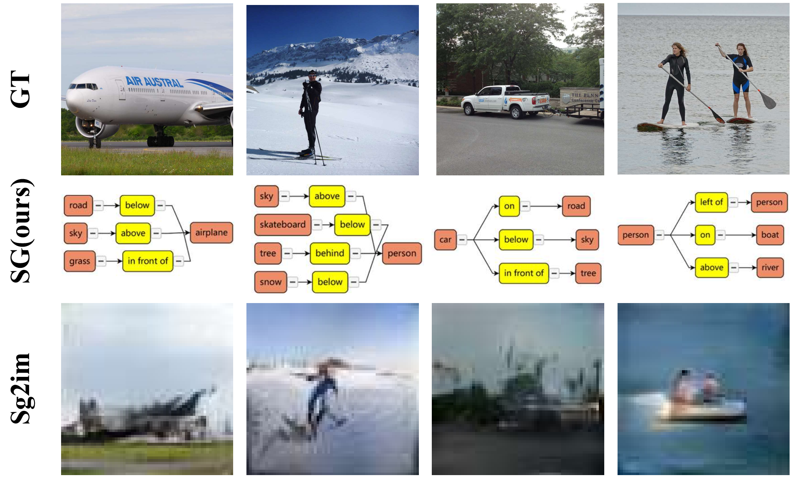

# SGDraw: Scene Graph drawing interface using Object-Oriented representation

>**Overview of our interface**

***Workflow of the proposed interface.*** (A) With a task image inputted to the SGDraw, the user starts (B) adding objects, and then they can (C) add attributes or (D) relationships. After that, they can choose to (E) use the auxiliary operations (like cloning, as shown in the figure) to change the structure of the graph. Repeat these steps until (F) obtains the desired scene graph.

>**Workflow**

***Screenshot of the SGDraw interface.*** On the left is the input image display area, and on the right is the scene graph operation and real-time generation area. Meanwhile, on the right side of the interactive interface, we provide some common attributes and relationships for users to choose and reference.

>**Functions**

***Adding.*** When the user right-clicks on the canvas, an object will be created automatically. If double right click on an object node, an attribute node will be added to the canvas. If right click on two object nodes in order, a relationship node will be added.

***Removing.*** The design of the removing function is based on the concept of tree construction, and the removing operation is implemented with the commonly used backspace key. Users are allowed to select any connection line for deletion, so as to divide the whole tree structure into several subtrees. Users can also select a node to delete, both the selected node and its subtrees will be deleted at the same time.

***Cloning.*** The design of the cloning function is still based on the tree structure. When users select a node, its subtree will also be selected and copied, so as to ensure that the attributes and relationships corresponding to the object can also be copied. The function keys are designed as "Ctrl", "C", and "V". "Ctrl + C" to realize the copy function, and "Ctrl + V" to realize the paste function. This is consistent with people's usual habits, so it will not bring operation trouble to users.

***Undo.*** We design the Undo function. This function is implemented based on "Ctrl" and "Z". It allows users to go back to the previous scene graph state. Users can go back until all operations disappear. This will reduce the users' error cost and simplify the modification process.

***Zoom and Collapsing.*** Scene graphs will get large for complex images. One way to simplify the scene graphs is to hide the branches of the tree. "Collapsing" a node means making all of its children and the links to them, not visible, and recursively collapsing all of the children that have children. The other operation is zoom in/zoom out, the SGDraw allows users to use the mouse wheel to zoom in or zoom out the scene graphs, which supports users to draw more scene graphs in a limited drawing area.

***Dragging.*** We provide users with a tree layout to display the scene graphs hierarchically on the interface. Users are allowed to modify the default layout by dragging nodes or edges.

***Saving and Loading.*** The result will be saved both in JSON and SVG formats.(In this code version, we change the JSON format to txt for our following research. If you want to use JSON format, go.js provides a very simple way to get it.)

>**Using for follow-up research**

***The results of our interface can be adapted to the subsequent pieces of research.*** The first row is the ground truth images from the VG dataset. The second row is the scene graphs drawn on our interface. In particular, we only suggest the user write objects and relationships due to the limitation of the generation algorithm. The third row is the images generated by [sg2im](https://openaccess.thecvf.com/content_cvpr_2018/html/Johnson_Image_Generation_From_CVPR_2018_paper.html) according to our results.

